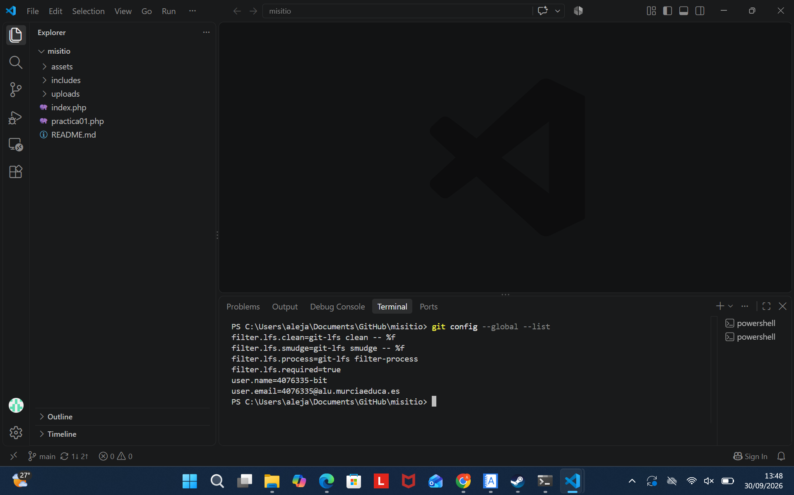
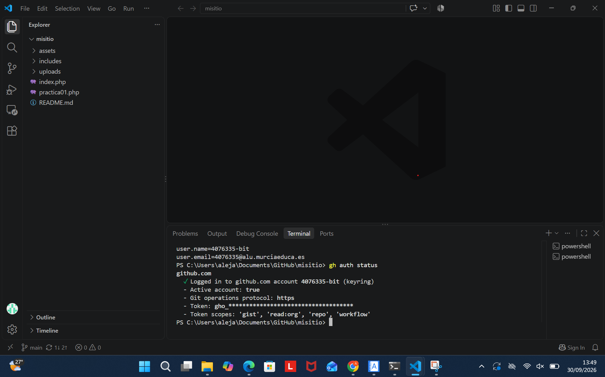
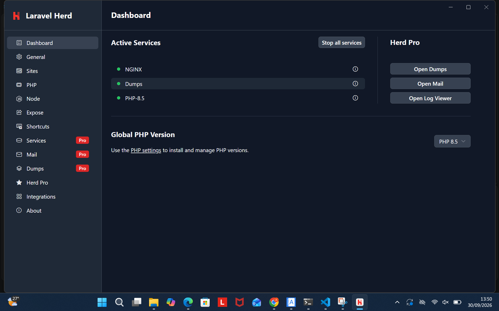
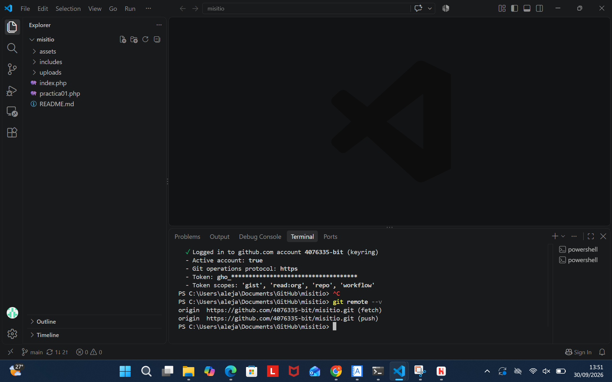
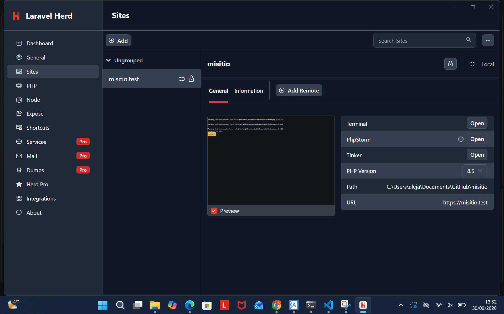

# Instalación y configuración del sitio web local


## 1. Git instalado y configurado

Instala Git y configura el nombre y el correo que se asociarán a tus commits. Comprueba la instalación y revisa la configuración con estos comandos:

```bash
git config --global --list
```

La captura muestra Git instalado y configurado en el equipo local.



## 2. GitHub CLI instalado y autenticado

GitHub CLI (`gh`) permite gestionar la conexión con GitHub desde la terminal. Una vez instalado, inicia sesión y comprueba que la autenticación está activa:

```bash
gh auth status
```

La salida de `gh auth status` permite verificar la cuenta autenticada.



## 3. Herd instalado con PHP 8.4

Instala Herd y selecciona PHP 8.4 como versión para el entorno local. Verifica la versión activa desde la terminal:

```bash
php -v
```

La captura muestra Herd instalado y la versión de PHP 8.4.



## 4. Repositorio `misitio` clonado en local

Clona el repositorio del proyecto en el equipo.

```bash
git remote -v
```

La captura muestra el repositorio `misitio` descargado en local.



## 5. Herd enlazado a `misitio` y servido por HTTPS

Desde la carpeta del proyecto, crea el enlace local con Herd y habilita HTTPS:

Abre en el navegador el dominio local asignado por Herd y comprueba que el sitio carga y que la dirección utiliza HTTPS.



## Resumen: ProperDocs y Read the Docs

En ProperDocs, el contenido se estructura en apartados para que el proceso sea fácil de seguir; se emplean encabezados, bloques de código y capturas con texto alternativo. Para publicar la documentación en Read the Docs, se conecta el repositorio del proyecto y se configura la compilación de la documentación. Read the Docs utiliza Sphinx para generar las páginas y el tema de Read the Docs para presentarlas. La compilación permite comprobar que las páginas y sus recursos, incluidas las imágenes, se procesan correctamente.
